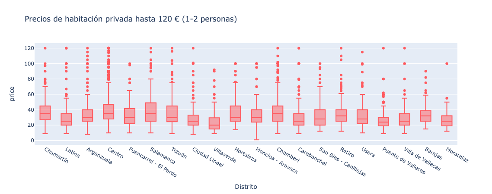
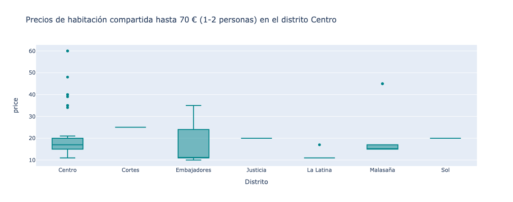
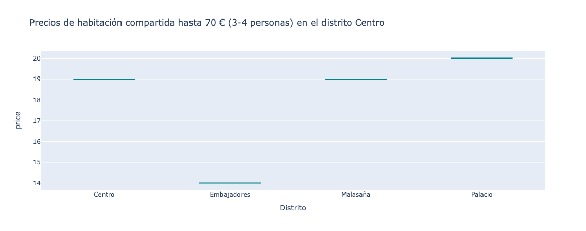

  

Uno de nuestros clientes opera en el mercado de inmuebles. Está especialmente interesado en Madrid, donde posee una cantidad importante de viviendas publicadas en la plataforma AirBnB y nos pide que le asesoremos respondiendo a la siguiente pregunta:

    ¿Qué puedo hacer para optimizar el precio de mis viviendas?

1. Elaborar un contexto del problema
2. Definir el problema que queremos resolver
3. Definir y desarrollar el roadmap del análisis
4. Recopilar los principales insights para montar el storytelling final:
    - contexto
    - problema
    - insights

CONTEXTO

Se analizarán los listados para viviendas, excluyendo habitaciones de hoteles:  
- shared_room (habitación compartida) hasta 70 euros  
- private_room (habitación privada) hasta 120 euros  
- entire_home_apt (piso/casa entera) hasta 300 euros  
Se analizarán las variables que puedan influir en los precios dentro de estos rangos.  

En primer lugar, se llevará a cabo un análisis de los precios de mercado para determinar si los alquileres listados por el cliente se ajustan a ellos.  
Posteriormente, se analizarán las variables que podrían influir en los precios más altos dentro de los rangos mencionados. 

CONSIDERACIONES:  

Al analizar neighbourhood_group (distritos de Madrid), se quita Vicálvaro, ya que no hay suficientes entradas para analizar.

Porcentaje dentro del total de listados que acomodan a:
- 1 persona(s): 13.99%
- 2 persona(s): 34.11%
- 3 persona(s): 9.38%
- 4 persona(s): 24.48%
- 5 persona(s): 5.19%
- 6 persona(s): 9.22%
- 7 persona(s): 1.33%
- 8 persona(s): 2.29%

Se considerarán las viviendas que acomoden hasta 6 personas.

1. DISTRIBUCION DE LOS PRECIOS

  

  

2. PRECIOS POR DISTRITO SEGÚN EL TIPO DE HOSPEDAJE

  

  

  

  

  

  

  

  

  

3. PRECIOS POR VECINDARIOS DEL CENTRO DE MADRID SEGÚN EL TIPO DE HOSPEDAJE

  

  

  

  

  

  

  

  

  

---

4. RELACIÓN DEL PRECIO POR COMODIDADES, CANTIDAD DE PERSONAS Y TIPO DE HABITACIÓN. 

---

- Habitación compartida. 
Considerando el rango de precios de 0 a 70 euros.

  

El número de shared_room que acomodan 3 personas y tienen un precio de menos de 70 euros y no tienen WIFI es: 0  
El número de shared_room que acomodan 6 personas y tienen un precio de menos de 70 euros es: 0  
El número de shared_room que acomodan 6 personas, tienen un precio de menos de 70 euros y no tienen calefacción es: 0  

// No hay habitación compartida de 3 personas listada sin WIFI, por lo tanto solo muestra el valor True.  
// No hay habitación compartida de 6 personas listada sin calefacción, por lo tanto solo muestra el valor True.  
// No hay habitaciones compartidas de 5 personas listadas por menos de 70 euros. //

El número de shared_room que acomodan 5 personas y tienen un precio de menos de 70 euros es: 0  
El número de shared_room que acomodan 6 personas y tienen un precio de menos de 70 euros es: 9  

Diferencia en la mediana para amenities_wifi_internet:  
------------------------------------------------------  
- Acomodates 3 personas: nan  
- Acomodates 4 personas: -39.5  

Diferencia en la mediana para amenities_tv:  
------------------------------------------------------  
- Acomodates 3 personas: -10.0  
- Acomodates 4 personas: -11.0  

Diferencia en la mediana para amenities_air_conditioning:  
------------------------------------------------------  
- Acomodates 3 personas: -25.0  
- Acomodates 4 personas: -4.5  

Diferencia en la mediana para amenities_heating:  
------------------------------------------------------  
- Acomodates 3 personas: -40.0  
- Acomodates 4 personas: -25.5  

Diferencia en la mediana para amenities_kitchen:  
------------------------------------------------------  
- Acomodates 2 personas: -7.5  

  

CONCLUSIONES DE AMENITIES PARA HABITACIÓN COMPARTIDA (comodidades)
 
- Tener WIFI puede aumentar el precio para habitaciones compartidas de 4 personas, en 39.5 euros de mediana.
- Tener TV puede aumentar el precio para habitaciones compartidas de 3 personas, 10 euros y 4 personas, 11 euros de mediana correspondientemente.
- Tener AIRE ACONDICIONADO puede aumentar el precio para habitaciones compartidas de 3 personas, 25 euros de mediana y de 4 personas, 4.5 euros de mediana.
- Tener CALEFACCIÓN puede aumentar el precio para habitaciones compartidas de 3 personas, 40 euros de mediana y para 4 personas, 25 euros de mediana.
- Tener COCINA puede aumentar el precio para habitaciones compartidas de 2 personas, 7.5 euros de mediana.  

---

- Habitación privada  
  Considerando el rango de precios de 0 a 120 euros  

  

El número de private_room que acomodan 5 personas y tienen un precio de menos de 120 euros es: 33  
El número de private_room que acomodan 6 personas y tienen un precio de menos de 120 euros es: 18  

Diferencia en la mediana para amenities_wifi_internet
------------------------------------------------------
Para habitación privada:  
- Tener WIFI puede aumentar el precio para habitaciones privadas de 2 personas y 5 personas.  
  - Acomodates 2 personas: -3.0  
  - Acomodates 5 personas: -31.5  

Diferencia en la mediana para amenities_tv
------------------------------------------------------
Para habitación privada:  
- Tener TV puede aumentar el precio ligeramente para habitaciones privadas de 4 y 5 personas.  
  - Acomodates 4 personas: -3.0  
  - Acomodates 5 personas: -3.0  

Diferencia en la mediana para amenities_air_conditioning
------------------------------------------------------
Para habitación privada:  
- Tener AIRE ACONDICIONADO puede aumentar el precio para 4, 5 y 6 personas.  
  - Acomodates 4 personas: -4.0  
  - Acomodates 5 personas: -18.0  
  - Acomodates 6 personas: -11.5  

Diferencia en la mediana para amenities_heating
------------------------------------------------------
Para habitación privada:  
- Tener CALEFACCIÓN puede aumentar el precio para 3, 4, 5 y 6 personas.  
  - Acomodates 3 personas: -2.0  
  - Acomodates 4 personas: -16.0  
  - Acomodates 5 personas: -26.0  
  - Acomodates 6 personas: -11.0  

Diferencia en la mediana para amenities_kitchen
------------------------------------------------------
Para habitación privada:  
- Tener COCINA puede aumentar el precio para habitaciones privadas de 1, 2, 3, 4 y 5 personas.  
  - Acomodates 1 personas: -3.0  
  - Acomodates 2 personas: -1.0  
  - Acomodates 3 personas: -5.0  
  - Acomodates 4 personas: -5.0  
  - Acomodates 5 personas: -10.0  

  

CONCLUSIONES DE AMENITIES PARA HABITACIÓN PRIVADA (comodidades)

- Tener WIFI puede aumentar el precio para habitaciones privadas que acomoden a 2 personas, 3 euros de mediana y 5 personas 31.5 euros de mediana. No hay habitaciones privadas que acomoden a 4 y 6 personas sin WIFI.
- Tener TV puede aumentar el precio para habitaciones privadas que acomoden a 4 personas, 3 euros de mediana y 5 personas, 3 euros de mediana.
- Tener AIRE ACONDICIONADO puede aumentar el precio para habitaciones privadas que acomoden a 4 personas, 4 euros de mediana, 5 personas, 18 euros de mediana y 6 personas, 11.5 euros de mediana.
- Tener CALEFACCIÓN puede aumentar el precio para habitaciones privadas que acomoden a 3 personas, 2 euros de mediana, 4 personas, 16 euros de mediana, 5 personas, 26 euros de mediana y 6 personas 11 euros de mediana.
- Tener COCINA puede aumentar el precio para habitaciones privadas 1 persona, 3 euros de mediana, 2 personas 1 euro de mediana, 3 personas, 5 euros de mediana, 4 personas 5 euros de mediana y 5 personas 10 euros de mediana. 

---

- Piso entero
Considerando el rango de precios de 0 a 300 euros.

  

El número de entire_home_apt que acomodan 4 personas y tienen un precio de menos de 300 euros es: 4476
El número de entire_home_apt que acomodan 6 personas y tienen un precio de menos de 300 euros es: 1698
## Diferencia en la mediana para amenities_wifi_internet
------------------------------------------------------
Para piso/casa entera:
- Tener WIFI puede aumentar el precio para piso/casa entera que acomode a 4 personas.
Acomodates 4 personas: -1.0
------------------------------------------------------
## Diferencia en la mediana para amenities_tv
------------------------------------------------------
Para piso/casa entera:
- Tener TV puede aumentar el precio ligeramentepara piso/casa entera que acomode a 6 personas.
Acomodates 6 personas: -1.0
------------------------------------------------------
## Diferencia en la mediana para amenities_heating
------------------------------------------------------
Para piso/casa entera:
- Tener CALEFACCIÓN puede aumentar el precio para piso/casa entera que acomode a 1 persona o 6 personas.
Acomodates 1 persona: -47.5
Acomodates 6 personas: -0.5
------------------------------------------------------
## Diferencia en la mediana para amenities_kitchen
------------------------------------------------------
Para piso/casa entera:
- Tener COCINA puede aumentar el precio para piso/casa entera que acomode 1 persona, 3 personas, 4 personas o 6 personas.
Acomodates 1 persona: -47.0
Acomodates 3 personas: -11.5
Acomodates 4 personas: -1.5
Acomodates 6 personas: -41.0
------------------------------------------------------

  

---

CONCLUSIONES DE AMENITIES PARA PISO/CASA ENTERA (comodidades)

Para piso/casa entera:  
- Tener WIFI puede aumentar el precio para piso/casa entera que acomode a 4 personas, 1 euro de mediana.
- Tener TV puede aumentar el precio para piso/casa entera que acomode a 6 personas, 1 euro de mediana.
- Tener AIRE ACONDICIONADO no aumenta el precio para piso/casa entera.
- Tener CALEFACCIÓN puede aumentar el precio para piso/casa entera que acomode a 1 persona, 47.5 euros de mediana o 6 personas, 0.5 euros de mediana.
- Tener COCINA puede aumentar el precio para piso/casa entera que acomode 1 persona, 47 euros de mediana, 3 personas, 11.5 euros de mediana, 4 personas, 1.5 euros de mediana o 6 personas, 41 euros de mediana.

---

5. RELACIÓN DE RESEÑAS POR PRECIO.

  

  

CONCLUSIONES DE REVIEWS

Los alojamientos con la mayor cantidad de excelentes reseñas sobre la limpieza podrían justificar precios más elevados dentro de su categoría.  
Por otro lado, una abundancia de críticas positivas en cuanto a la calificación general (review_score_rating), especialmente en el caso de habitaciones privadas y alojamientos enteros, parece no estar relacionada con precios más altos, aunque es de mencionar, que los precios más altos no poseen menos críticas negativas.

En relación a la cantidad de reseñas mensuales o la cantidad de reseñas total, se sugiere que menos reseñas podrían ser indicativas de una mejor percepción y la posibilidad de aumentar el precio.

---

6. RELACIÓN DE ANFITRIÓN POR PRECIO.

  

  

CONCLUSIONES DE ANFITRIÓN

La tasa de respuesta del anfitrión, especialmente dentro del primer día, aumenta la posibilidad de que los precios de los alquileres sean más altos.  
Ser superhost, tener una foto de perfil y verificar el correo electrónico o la identificación (DNI) no parecen tener un impacto significativo en el precio de los alquileres, aunque podrían ser considerados como exigencia en propiedades más caras.  
Por otro lado, la verificación del número de teléfono y la cuenta de Facebook parece estar asociada a un aumento en el precio de los alquileres.
